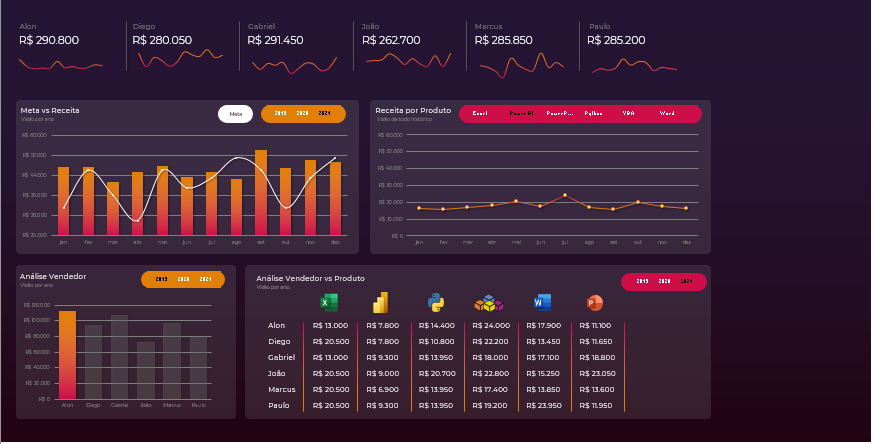

# 📈 Dashboard de Desempenho Comercial - Jornada de Excel


## 📌 Sobre o Projeto
Este projeto foi desenvolvido como parte da **Jornada de Excel**, integrada ao treinamento **Análise de Dados Impressionador** da **Hashtag Treinamentos**. O objetivo é transformar bases de dados transacionais brutas em uma solução de Business Intelligence robusta no Excel, permitindo o acompanhamento de metas, faturamento e performance de produtos e vendedores.

A solução foca em responder a perguntas estratégicas de negócio utilizando recursos de modelagem de dados, tratamento de exceções (limpeza de nomes e datas) e análises dinâmicas.

---

## 📂 Estrutura das Bases de Dados
O projeto processa o histórico transacional da empresa consolidado entre os anos de **2019 e 2021**. A estrutura dos dados abrange as seguintes entidades:

*   **Dimensões de Clientes:** Controle e cadastro de clientes (`Nome`, `Sobrenome` e identificadores unificados).
*   **Dimensões da Equipe Comercial:** Monitoramento da performance de vendedores (`Alon`, `Diego`, `Gabriel`, `João`, `Marcus`, `Paulo`).
*   **Segmentação Regional:** Agrupamento de performance por regiões do Brasil (`Sudeste`, `Centro-Oeste`, `Norte`, `Sul`, `Nordeste`).
*   **Portfólio de Produtos:** Categorias de cursos comercializados (`Excel`, `Power BI`, `Python`, `VBA`, `Word`, `PowerPoint`).
*   **Dados Financeiros:** Métricas de receita (`Valor` transacionado por venda).

---

## 🛠️ Tecnologias e Funcionalidades Implementadas

O projeto foi construído utilizando metodologias profissionais de estruturação de dados dentro do Microsoft Excel:

### ⚡ 1. ETL e Tratamento de Dados (Power Query / Fórmulas de Texto)
*   **Padronização de Nomes:** Tratamento e correção de strings e espaçamentos em campos críticos (como `Primeiro Nome Cliente` e `Sobrenome Cliente`).
*   **Sincronização Cronológica:** Formatação e tratamento de dados temporais para a criação de uma linha do tempo contínua (sincronização de formatos de `Mês` textuais como "janeiro" e "jan").

### 📊 2. Análise Dinâmica e Tabelas Dinâmicas (Fatos e Dimensões)
*   **Matriz de Performance por Vendedor:** Cruzamento de faturamento real anual contra metas estipuladas.
*   **Análise Sazonal (Faturamento Mensal):** Visão consolidada mês a mês para identificação de períodos de pico e vales de vendas.
*   **Share de Receita por Produto:** Distribuição do faturamento total indexado pelas linhas de produtos (Cursos).

### 🎨 3. Dashboard Interativo (Visualização de Dados)
*   *Design* focado na experiência do usuário (UX/UI Dashboard), com segmentadores de dados (Slicers) para filtros dinâmicos de ano, região e produto.
*   Gráficos de Linhas e Colunas combinados para acompanhamento visual do Faturamento Real vs. Meta Mensal.

---


## 📸 Visualização do Dashboard




---

## 🚀 Como Executar o Projeto Localmente

1.  Certifique-se de ter o **Microsoft Excel** instalado em sua máquina.
2.  Clone este repositório para o seu ambiente local:
    ```bash
    git clone https://github.com/VerlaAcosta1973/AnaliseVendasExcel
    ```
3.  Abra o arquivo `.xlsx` do projeto.
4.  Caso utilize os recursos do Power Query e mova os arquivos de dados de pasta, lembre-se de atualizar o caminho das fontes em: **Dados** > **Consultas e Conexões** > **Configurações da Fonte de Dados**.
